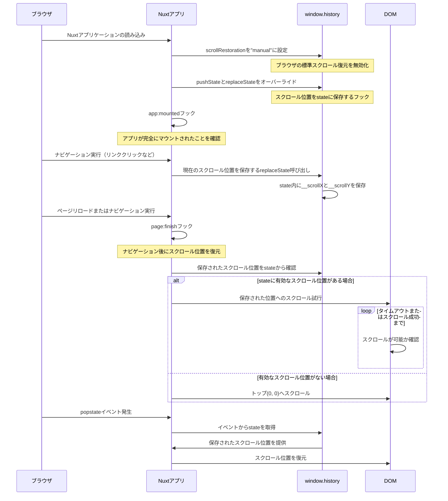

# nuxt-scroll-restoration

[![npm version][npm-version-src]][npm-version-href]
[![License][license-src]][license-href]

> ブラウザバック時やリロード時にスクロール位置を復元するNuxt 3モジュール

## ライセンス

[Apache 2.0 License](./LICENSE)

<!-- リンク -->
[npm-version-src]: https://img.shields.io/npm/v/nuxt-scroll-restoration/latest.svg?style=flat&colorA=18181B&colorB=28CF8D
[npm-version-href]: https://npmjs.com/package/nuxt-scroll-restoration
[license-src]: https://img.shields.io/npm/l/nuxt-scroll-restoration.svg?style=flat&colorA=18181B&colorB=28CF8D
[license-href]: https://npmjs.com/package/nuxt-scroll-restoration

## 機能

- SPAのページ遷移時やブラウザバック時にスクロール位置を記憶・復元
- ページ編集中や表示中に最新化するためにリロードした後も同じ位置を表示
- 動的に読み込まれるコンテンツにも対応するための遅延スクロール機能搭載
- クライアントサイドのみで動作し、サーバーサイドには影響なし
- History APIをフックして効率的にスクロール位置を管理

## 制約事項

- ブラウザがHistory APIをサポートしている必要があります（ほとんどのモダンブラウザは対応済み）
- 動的コンテンツが遅れて読み込まれる場合、タイミングによっては正確なスクロール位置復元が難しい場合があります
- スクロール復元の最大試行時間は3秒（デフォルト）以内です

## セットアップ

```bash
npm install nuxt-scroll-restoration
```

`nuxt.config.ts`ファイルにモジュールを追加します：

```ts
export default defineNuxtConfig({
  modules: [
    'nuxt-scroll-restoration'
  ],
  
  // オプション設定（任意）
  scrollRestoration: {
    scrollRestorationTimeoutMs: 3000, // スクロール位置復元の最大試行時間（ミリ秒）
    tryToScrollIntervalMs: 50        // スクロール位置復元の試行間隔（ミリ秒）
  }
})
```

以上で設定完了です。このモジュールは自動的にスクロール位置の復元機能を有効化します。

## 動作の仕組み

このモジュールは以下の仕組みでスクロール位置を復元します：

1. ブラウザの標準スクロール復元機能（`history.scrollRestoration`）を無効化
2. Historyのstate操作をフックして、現在のスクロール位置を記録
3. ページ遷移後、保存したスクロール位置に復元を試みる
4. 動的コンテンツの読み込みを考慮して、一定時間スクロール復元を繰り返し試行

### シーケンス図



## 開発

```bash
# 開発環境の起動
npm run dev

# パッケージのビルド
npm run build

# ESLintによるコードチェック
npm run lint

# TypeScriptの型チェック
npm run typecheck

# リントと型チェックを実行
npm run check

# パッケージ公開前の準備（lint、typecheck、build）
npm run prepack

# パッケージのビルドと公開
npm run release
```
