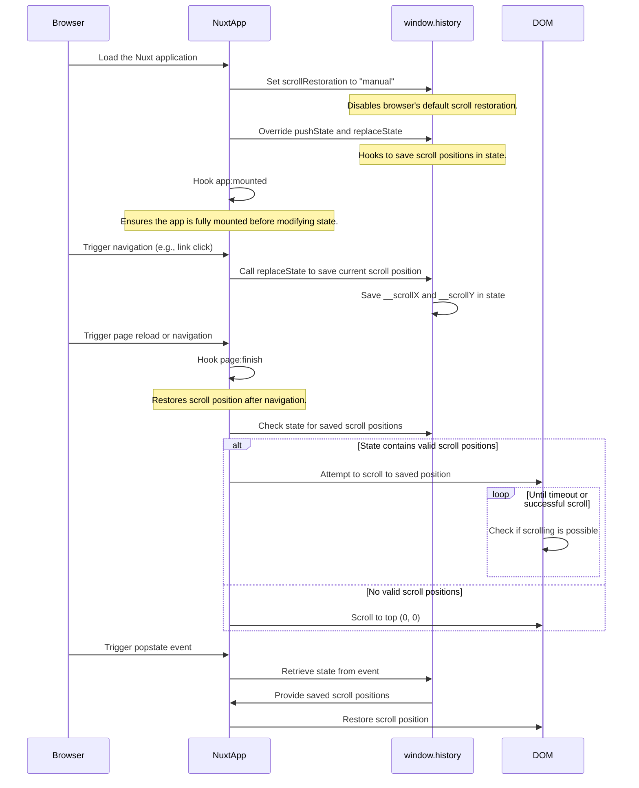

#
nuxt-scroll-restoration

[![npm version][npm-version-src]][npm-version-href]
[![License][license-src]][license-href]

> A Nuxt 3 module that restores scroll position during browser back navigation and page reloads

日本語 [README-ja.md](README-ja.md)

## License

[Apache 2.0 License](./LICENSE)

<!-- Links -->
[npm-version-src]: https://img.shields.io/npm/v/nuxt-scroll-restoration/latest.svg?style=flat&colorA=18181B&colorB=28CF8D
[npm-version-href]: https://npmjs.com/package/nuxt-scroll-restoration
[license-src]: https://img.shields.io/npm/l/nuxt-scroll-restoration.svg?style=flat&colorA=18181B&colorB=28CF8D
[license-href]: https://npmjs.com/package/nuxt-scroll-restoration

## Features

- Remembers and restores scroll positions during SPA page transitions and browser back navigation
- Maintains the same view position after reloading a page during editing or viewing
- Includes delayed scrolling functionality to accommodate dynamically loaded content
- Operates exclusively on the client-side with no impact on server-side operations
- Efficiently manages scroll positions by hooking into the History API

## Limitations

- Requires browser support for the History API (supported by most modern browsers)
- May have difficulty with precise scroll position restoration when dynamic content is loaded with timing issues
- The maximum time for scroll restoration attempts is 3 seconds (default)

## Setup

```bash
npm install nuxt-scroll-restoration
```

Add the module to your `nuxt.config.ts` file:

```ts
export default defineNuxtConfig({
  modules: [
    'nuxt-scroll-restoration'
  ],
  
  // Optional configuration
  scrollRestoration: {
    scrollRestorationTimeoutMs: 3000, // Maximum time to attempt scroll restoration (milliseconds)
    tryToScrollIntervalMs: 50        // Interval between scroll restoration attempts (milliseconds)
  }
})
```

That's it! The module automatically enables scroll position restoration functionality.

## How It Works

This module restores scroll positions using the following mechanism:

1. Disables the browser's standard scroll restoration (`history.scrollRestoration`)
2. Hooks into History state operations to record the current scroll position
3. Attempts to restore the saved scroll position after page transitions
4. Repeatedly tries to restore the scroll position over a period of time to account for dynamically loaded content

### Sequence Diagram



## Development

```bash
# Start the development environment
npm run dev

# Build the package
npm run build

# Run ESLint code checks
npm run lint

# Run TypeScript type checking
npm run typecheck

# Run lint and type checking
npm run check

# Prepare for package publishing (lint, typecheck, build)
npm run prepack

# Build and publish the package
npm run release
```
